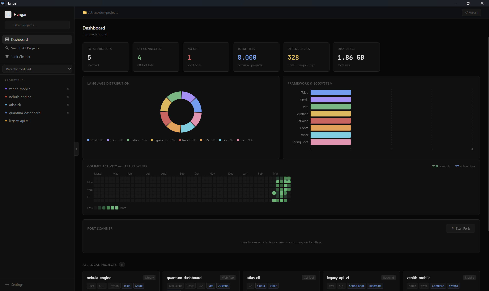
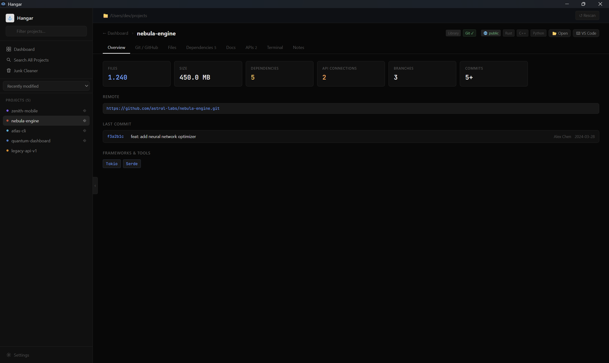

<div align="center">


# Hangar

**A local-first developer project dashboard for Windows 11**

_Built with Tauri 2 · Rust · React 18 · TypeScript_

</div>

---

<p align="center">
  
</p>

<p align="center">
  
</p>

---

Hangar gives you a unified command centre for every project on your machine. Scan your Projects folder and instantly see language distributions, commit history, GitHub stats, dependencies, running dev servers, and more — all without leaving your desktop.

## Features

- **Dashboard overview** — total projects, git status, disk usage, file counts, language/framework charts
- **GitHub-style contributions graph** — 52-week commit heatmap across all your git repos
- **Per-project detail** — 8 tabs: Overview · Git/GitHub · Files · Dependencies · Docs · APIs · Terminal · Notes
- **Branch management** — switch local branches with one click; commits update instantly
- **GitHub integration** — stars, forks, open issues/PRs, topics, branches, README, public/private badge
- **GitHub Hub** — view and comment on issues/PRs across all your repositories
- **GitHub-only repos** — see which of your GitHub repos are not cloned locally
- **Full-text search** — search across all source files, docs, and configs simultaneously
- **Integrated terminal** — xterm.js terminal per project with npm/cargo/make script runner
- **Junk cleaner** — detect and bulk-delete node_modules, build artifacts, caches, logs
- **Port scanner** — see which dev servers are running on localhost right now
- **Vaultkeeper** — store and organise project secrets (AES-256-GCM encrypted, machine-local)
- **PingBoard** — uptime monitoring for local and remote services
- **Meridian** — time tracking derived from git commit history
- **Notes & tags** — attach colour-coded notes and tags to any project (persisted locally)
- **Collapsible sidebar** — with sort by date/name/size/files and filter

## Prerequisites

| Tool | Version |
|------|---------|
| [Node.js](https://nodejs.org/) | 18+ |
| [Rust](https://rustup.rs/) | stable |
| [Tauri CLI v2](https://tauri.app/start/prerequisites/) | `cargo install tauri-cli --version "^2"` |
| MSVC Build Tools | via Visual Studio Installer |
| WebView2 Runtime | included in Windows 11 |

## Setup

```bash
# 1. Clone and install frontend dependencies
git clone https://github.com/ArdaCTK/hangar
cd hangar
npm install

# 2. Development mode
npm run tauri dev

# 3. Production build
npm run tauri build
```

The installer will be at `src-tauri/target/release/bundle/`.

## First Launch

1. A **Settings** modal opens automatically on first launch.
2. Click **Browse** and select your Projects folder (e.g. `C:\Users\You\Desktop\Projects`).
3. Optionally add a **GitHub Personal Access Token** for private repos and higher API rate limits.
   - Required token scopes: `repo`, `read:user`
   - Generate at: https://github.com/settings/tokens
4. Click **Save & Scan**.

## Configuration

Settings and notes are stored locally at:

```
%APPDATA%\hangar\settings.json
%APPDATA%\hangar\notes.json
```

On Windows this maps to `C:\Users\<you>\AppData\Roaming\hangar\`.

## Security Notes

**GitHub token** — encrypted at rest in `settings.json` using AES-256-GCM with PBKDF2-derived keys and a random salt per write. It is only sent to the GitHub API.

**Vaultkeeper** — secrets are encrypted with AES-256-GCM and machine-bound PBKDF2 key derivation with random salt. Legacy plaintext and legacy encrypted vault files are auto-migrated to the stronger format on first read.

**PingBoard** — monitors use valid SSL certificate verification. Use `http://` for local dev servers that don't have HTTPS.

**Integrated terminal** — executes arbitrary commands that you type. Treat it as a trusted-developer tool and do not run untrusted input.

**Meridian estimates** — time is inferred from commit gaps and clamped between 15 and 120 minutes per commit interval. This is an estimate, not precise time tracking.

## Tech Stack

| Layer | Technology |
|-------|-----------|
| Desktop shell | Tauri 2 |
| Backend | Rust (walkdir, reqwest, aes-gcm, tokio, serde) |
| Frontend | React 18 + TypeScript |
| State | Zustand |
| Charts | Recharts |
| Terminal | xterm.js |
| Styling | Vanilla CSS (dark minimal theme) |

## Contributing

Contributions are welcome! See [CONTRIBUTING.md](CONTRIBUTING.md) for guidelines.

## License

See [LICENSE](LICENSE). Source-available — personal and non-commercial use only. Credit required.
